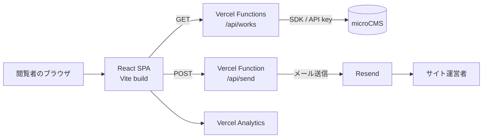

# システム設計

## 1. 目的

このサイトは、制作者のプロフィール、経歴、技術スキル、制作実績を閲覧者に伝え、問い合わせにつなげるための SPA（Single Page Application）です。プロフィール等はソースコードで管理し、更新頻度が高い制作実績は microCMS で管理します。

## 2. 全体構成

ブラウザに microCMS と Resend の秘密鍵を渡さないため、外部サービスへの接続はサーバー側の Vercel Functions が担当します。

## 3. レイヤーと責務

| レイヤー | 主な場所 | 責務 |
| --- | --- | --- |
| エントリ・ルーティング | `src/main.tsx` | React の起動、URL とページの対応付け |
| ページ | `src/App.tsx`, `src/pages/` | 画面単位の状態管理、データ取得、表示構成 |
| コンポーネント | `src/components/` | セクション、カード、フォーム、共通 UI |
| 静的データ | `src/data/` | プロフィール、経歴、スキル |
| 型 | `src/types/` | UI 用作品型、microCMS 応答型 |
| BFF/API | `api/`, `vite.config.ts` | CMS データの取得・整形、メール送信 |
| 外部サービス | microCMS, Resend, Vercel | コンテンツ管理、メール配信、実行・配信・解析 |

## 4. 主要処理フロー

### 4.1 作品一覧の取得

1. トップ画面または作品一覧画面を表示する。
2. React が `GET /api/works` を呼び出す。
3. API が環境変数から microCMS の接続情報を取得する。
4. microCMS の `works` エンドポイントを `limit`、`offset` 付きで取得する。
5. API が CMS 固有のデータを UI 用の `WorksResponse` に整形する。
6. React がスライダーまたはグリッドとして描画する。

開発サーバーでは、`vite.config.ts` のミドルウェアが `/api/works` と `/api/works/:id` を代替します。本番では `api/works/` 配下の Vercel Functions が処理します。

### 4.2 作品詳細の取得

1. `/works/:id` から作品 ID を取得する。
2. `GET /api/works/:id` を呼び出す。
3. API が microCMS の `works` から指定 ID のコンテンツを取得する。
4. 詳細情報を UI 用の `Work` に整形する。
5. 詳細説明はリッチエディター HTML を Markdown に変換し、GFM 対応で描画する。

### 4.3 問い合わせ送信

1. 訪問者がフォームに名前、メールアドレス、メッセージを入力する。所属は任意。
2. React が JSON を `POST /api/send` へ送信する。
3. API が必須項目の存在を確認する。
4. Resend がサイト運営者へテキストメールを送信する。返信先には訪問者のアドレスを設定する。
5. 成功時はフォームを初期化し、結果メッセージを表示する。

## 5. フロントエンド設計

- React Router の `BrowserRouter` を利用する。
- トップ画面はセクションコンポーネントを縦に並べる。
- 作品情報は画面表示後に API から非同期取得する。
- コンポーネント固有のスタイルは通常 CSS または CSS Modules で管理する。
- GSAP/ScrollTrigger を経歴の横スクロールに利用する（画面幅 768px 超）。
- Splide をトップ画面の作品スライダーに利用する。
- OGL と GSAP をヒーロー領域の視覚効果・文字アニメーションに利用する。

## 6. データ管理方針

| データ | 管理場所 | 理由 |
| --- | --- | --- |
| プロフィール・経歴 | `src/data/profile.ts` | 小規模で画面実装と同時に更新可能 |
| スキル | `src/data/skills.ts` | アイコンと表示レベルをコードで一元管理 |
| 制作実績 | microCMS | 実績をデプロイせず追加・更新できる |
| 問い合わせ | Resend 経由のメール | アプリ内に個人情報を保存しない |

## 7. 非機能面の現状

- TypeScript は `strict` を有効化している。
- ESLint は TypeScript、React Hooks、React Refresh の推奨設定を利用する。
- Vercel Analytics をトップ画面に組み込んでいる。
- API キーは環境変数で管理し、クライアントコードへ埋め込まない。
- 現時点では自動テスト、CI 設定、キャッシュ制御、レート制限、スパム対策は実装されていない。

## 8. 設計上の注意点・改善候補

以下は現行実装を運用する際の注意点です。

- クライアントは `orders=publishedAt` を送っていますが、一覧 API はこの値を microCMS に渡していません。表示順を保証する場合は API 側で許可する並び順を定義します。
- `vite.config.ts` は作品 API のみを模擬します。`npm run dev` 単体では `/api/send` を処理できないため、問い合わせをローカル検証する場合は Vercel のローカル実行環境が必要です。
- トップの作品カード内で React Router の `Link` と HTML の `<a>` が入れ子になる構造があります。ナビゲーション要素を一つに統一する余地があります。
- 経歴データのリンクに `localhost` が含まれています。本番 URL に依存しない相対パスへの変更が望まれます。
- API は文字列長、メール形式、本文サイズのサーバー側検証やレート制限を行っていません。公開フォームではスパム・過大入力対策が必要です。
- `/works` を直接開いた場合の rewrite は設定に明記されていません。Vercel 上の実挙動を確認し、必要なら SPA 全体を対象とする rewrite を設定します。

